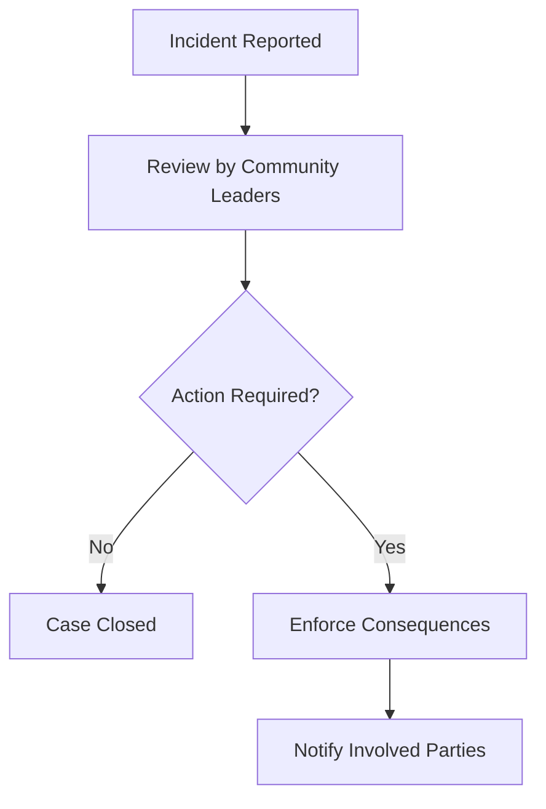

# Contributor Covenant Code of Conduct

## Our Pledge
We as members, contributors, and leaders pledge to make participation in our community a harassment-free experience for everyone, regardless of age, body size, visible or invisible disability, ethnicity, sex characteristics, gender identity and expression, level of experience, education, socio-economic status, nationality, personal appearance, race, caste, color, religion, or sexual identity and orientation.

We pledge to act and interact in ways that contribute to an open, welcoming, diverse, inclusive, and healthy community.

---

## Our Standards
Examples of behavior that contributes to a positive environment for our community include:
* Demonstrating empathy and kindness toward other people.
* Being respectful of differing opinions, viewpoints, and experiences.
* Giving and gracefully accepting constructive feedback.
* Accepting responsibility and apologizing to those affected by our mistakes, and learning from the experience.
* Focusing on what is best for the overall community, rather than individual interests.

Examples of unacceptable behavior include:
* The use of sexualized language or imagery, and unwelcome sexual attention or advances.
* Trolling, insulting or derogatory comments, and personal or political attacks.
* Public or private harassment.
* Publishing others' private information, such as a physical or email address, without their explicit permission.
* Other conduct which could reasonably be considered inappropriate in a professional setting.

---

## Enforcement Responsibilities
Community leaders are responsible for clarifying and enforcing our standards of acceptable behavior and will take appropriate, fair corrective action in response to any behavior they deem inappropriate, threatening, offensive, or harmful.

Community leaders have the right and responsibility to remove, edit, or reject comments, commits, code, wiki edits, issues, and other contributions that are not aligned to this Code of Conduct, and will communicate reasons for moderation decisions when appropriate.

---

## Scope
This Code of Conduct applies within all community spaces, and also applies when an individual is officially representing the community in public spaces. Examples of representing our community include using an official email address, posting via an official social media account, or acting as an appointed representative at an online or offline event.

---

## Reporting Guidelines

In the event of behavior violating this Code of Conduct, please contact the project maintainers directly. All reports will be reviewed and investigated promptly and fairly.

All community leaders are obligated to respect the privacy and security of the reporter of any incident.
