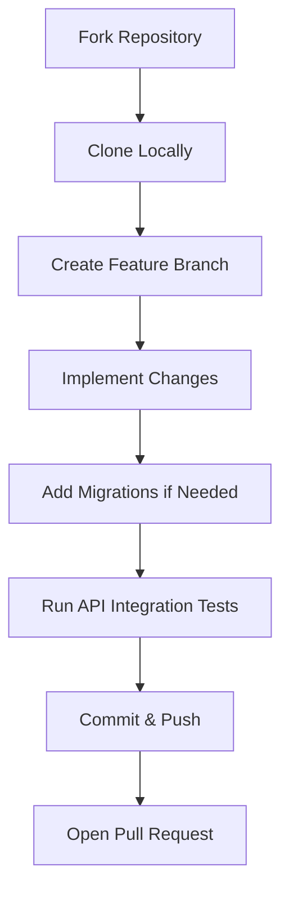

# Contributing to SAQ Inventory System Backend

Thank you for your interest in contributing to this project. Please follow these guidelines to ensure a smooth and consistent workflow.

---

## Contribution Workflow



### 1. Fork and Clone
Fork the repository on GitHub, then clone your fork locally:
```bash
git clone https://github.com/your-username/saq-inventory-system-backend.git
cd saq-inventory-system-backend
```

### 2. Set Up Environment
Configure your local environment by running the setup script and creating the `.env` file:
```powershell
.\scripts\setup.ps1
Copy-Item .env.example .env
```

### 3. Create a Feature Branch
Always create a descriptive branch for your changes:
```bash
git checkout -b feature/your-feature-name
```

---

## Development Standards

### 1. Clean Layered Architecture
Ensure you respect the directory separation rules:
* Keep HTTP parsing and DTO mapping inside `internal/handlers` and `internal/dto`.
* Keep business logic and transaction boundaries inside `internal/services`.
* Keep database interactions using `sqlx` inside `internal/repositories`.
* Keep dynamic DDL queries inside `internal/schema`.

### 2. Database Migrations
If your changes modify the database schema, you must write a migration using Goose.
* Create a new `.sql` file under the `migrations` directory following the naming format: `00000X_description.sql`.
* Provide both `-- +goose Up` and `-- +goose Down` sections.

### 3. Testing
Before opening a Pull Request, run the integration tests to make sure no existing functionality is broken:
```powershell
.\tests\api_test.ps1 -TestUpload
```

---

## Pull Request Guidelines

* Keep commits clean and atomic. Write descriptive commit messages.
* Ensure all database migrations run cleanly upwards and downwards.
* Provide a clear description in your Pull Request detailing:
  1. What changes were made.
  2. Why the changes are necessary.
  3. How you tested the changes.
