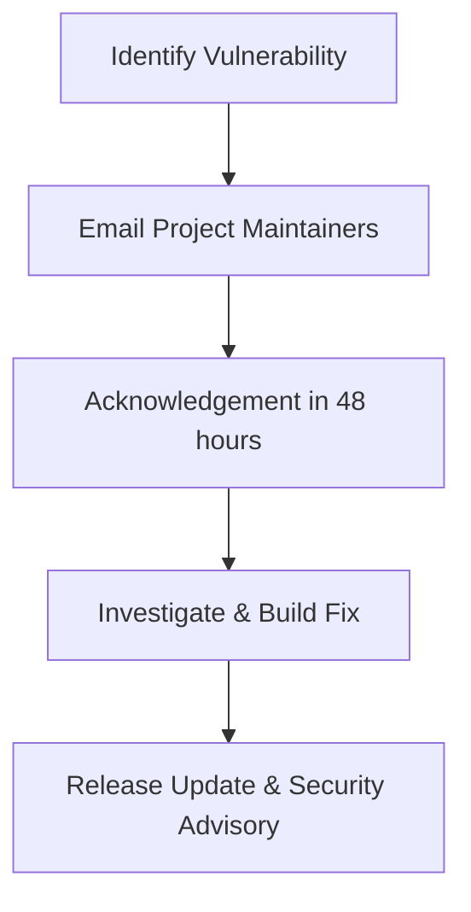

# Security Policy

## Supported Versions
Only the latest version of the SAQ Inventory System Backend is currently supported for security updates.

| Version | Supported |
|---------|-----------|
| v1.x    | Yes       |
| < v1.x  | No        |

---

## Reporting a Vulnerability

If you discover a security vulnerability within this project, please follow the process outlined below to report it. Do not open a public issue on GitHub.

### Reporting Steps
1. Email your findings directly to the project maintainers.
2. Include a detailed description of the vulnerability, steps to reproduce it, and any proof-of-concept (PoC) code if available.
3. We will acknowledge receipt of your report within 48 hours and outline next steps.
4. Once resolved, we will release a patch update and publish a security advisory.

---

## Codebase Security Design

When contributing code, please keep the following security considerations in mind:

### 1. SQL Injection Prevention
* All queries in repositories must use parameterized queries via `sqlx` (e.g. `db.Get(&dest, "SELECT ... WHERE id = ?", id)`).
* For dynamic schema generation in the `internal/schema` package, raw identifiers (table names and column names) are concatenated. You **must** validate these identifiers using `schema.ValidateIdentifier` and check them against the whitelist pattern before executing DDL.

### 2. Path Traversal Prevention
* Static file serving in routes (`StorageRoutes`) uses `http.Dir` and `http.FileServer`, which sanitizes request paths automatically. Ensure any custom file-system reads clean input paths using `filepath.Clean` and check that the resulting path is a subdirectory of the target directory.
