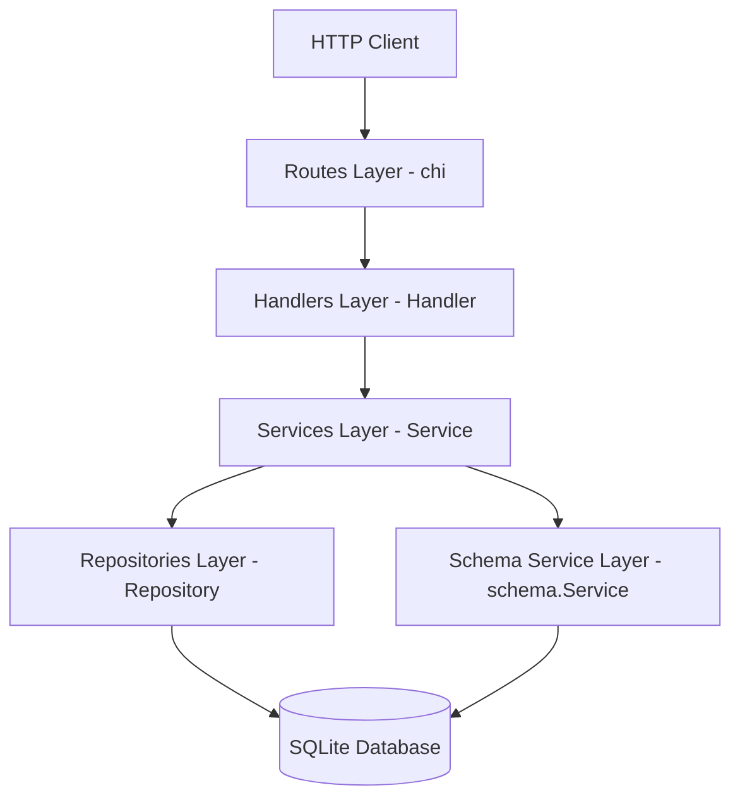
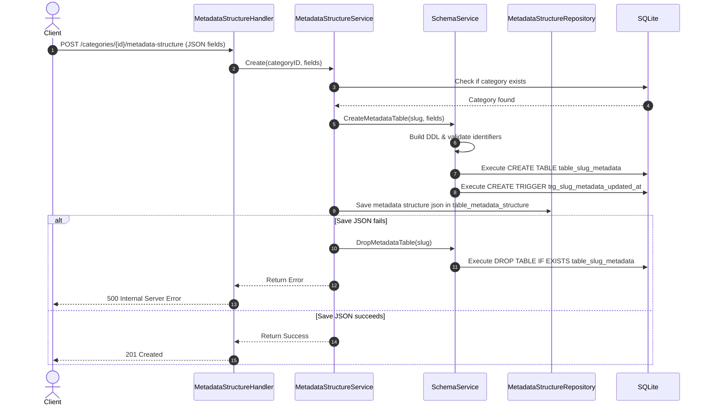

# Architecture Documentation

This document describes the design patterns, application layers, and request-response flow of the SAQ Inventory System Backend.

## Architectural Style
The project is built using a clean, layered architecture in Go, dividing responsibilities into distinct layers: routing, request handling, business services, data repositories, and dynamic schema generation.

## Layer Breakdown

### 1. Routes Layer
Located in `internal/routes`, this layer configures routing patterns and registers endpoints using the Chi router. It links HTTP paths and methods to specific handler methods.

### 2. Handlers Layer
Located in `internal/handlers`, handlers receive HTTP requests, parse query parameters or URL route parameters, bind request bodies to Data Transfer Objects (DTOs), validate basic input structures, invoke services, and write JSON responses.

### 3. Services Layer
Located in `internal/services`, services contain the core business logic. They orchestrate interactions between multiple repositories, manage transactional boundaries, and enforce business validation rules (such as check constraints or validation of dynamic field types).

### 4. Repositories Layer
Located in `internal/repositories`, repositories encapsulate all data access logic. They write and execute SQL statements against the SQLite database using sqlx. This isolates SQL syntax details from the business services.

### 5. Schema Service Layer
Located in `internal/schema`, the schema service builds and executes DDL (Data Definition Language) commands dynamically. When a category's metadata structure is defined, this service generates the corresponding database table and triggers in SQLite.

---

## Dynamic Metadata Architecture Flow
When a user defines a metadata structure for a category:
1. `MetadataStructureHandler` receives the request with the list of fields.
2. `MetadataStructureService` validates that the category exists.
3. `SchemaService` compiles a `CREATE TABLE` DDL using the field definitions, checking identifier safety via whitelist regex matching to prevent SQL injection.
4. `SchemaService` executes the DDL to create `table_{category_slug}_metadata`.
5. `SchemaService` creates an automatic update trigger for that metadata table.
6. `MetadataStructureRepository` stores the JSON structure definition into `table_metadata_structure`. If this step fails, a compensating drop-table step is executed.

