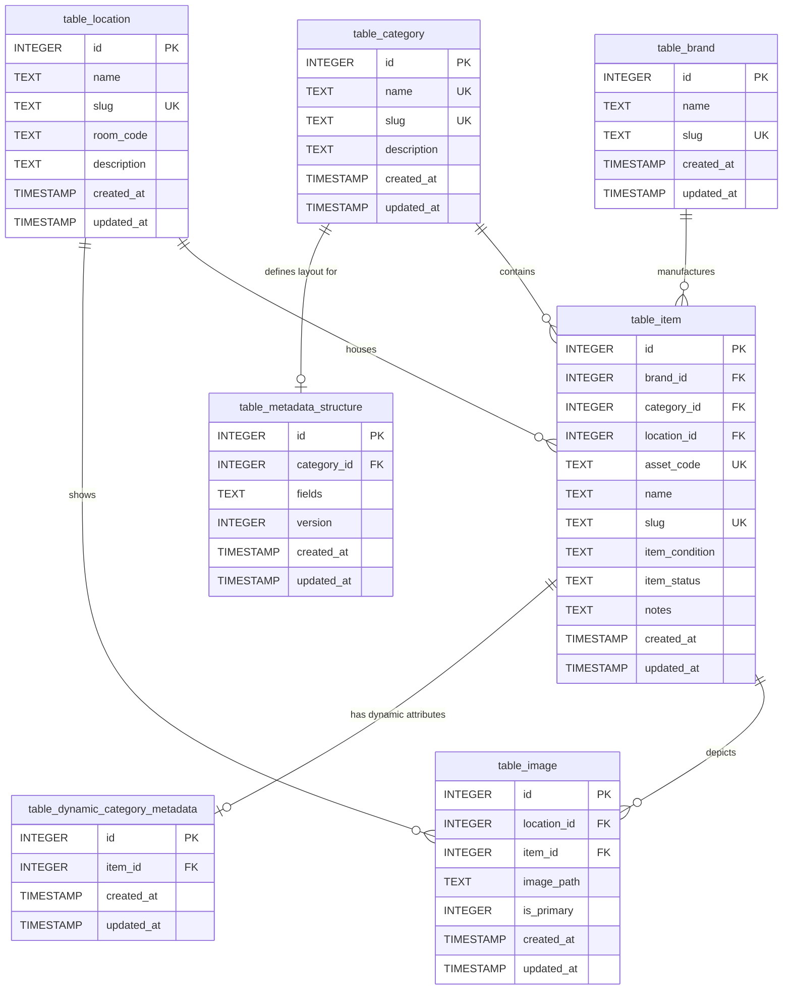

# Database Documentation

This document describes the database schema, tables, triggers, indexes, and the dynamic metadata generation architecture of the SAQ Inventory System.

## Database Engine
The system uses SQLite as its primary database. Foreign key support is enabled programmatically at startup.

## Entity Relationship Diagram



## Schema Definitions

### Static Tables

#### table_category
Stores the inventory categories.
* id (INTEGER, PK, AUTOINCREMENT): Unique identifier.
* name (TEXT, UNIQUE, NOT NULL): Category name.
* slug (TEXT, UNIQUE, NOT NULL): URL-friendly identifier.
* description (TEXT, NULL): Category description.
* created_at (TIMESTAMP): Record creation time.
* updated_at (TIMESTAMP): Last update time.

#### table_brand
Stores product brands.
* id (INTEGER, PK, AUTOINCREMENT): Unique identifier.
* name (TEXT, NOT NULL): Brand name.
* slug (TEXT, UNIQUE, NOT NULL): URL-friendly identifier.
* created_at (TIMESTAMP): Record creation time.
* updated_at (TIMESTAMP): Last update time.

#### table_location
Stores inventory storage locations.
* id (INTEGER, PK, AUTOINCREMENT): Unique identifier.
* name (TEXT, NOT NULL): Location name.
* slug (TEXT, UNIQUE, NOT NULL): URL-friendly identifier.
* room_code (TEXT, NULL): Physical room or section code.
* description (TEXT, NULL): Location description.
* created_at (TIMESTAMP): Record creation time.
* updated_at (TIMESTAMP): Last update time.

#### table_item
Stores individual inventory items.
* id (INTEGER, PK, AUTOINCREMENT): Unique identifier.
* brand_id (INTEGER, FK, NULL): References table_brand(id) ON UPDATE CASCADE ON DELETE SET NULL.
* category_id (INTEGER, FK, NOT NULL): References table_category(id) ON UPDATE CASCADE ON DELETE RESTRICT.
* location_id (INTEGER, FK, NULL): References table_location(id) ON UPDATE CASCADE ON DELETE SET NULL.
* asset_code (TEXT, UNIQUE, NOT NULL): Unique organization asset code.
* name (TEXT, NOT NULL): Item name.
* slug (TEXT, UNIQUE, NOT NULL): URL-friendly identifier.
* item_condition (TEXT, NOT NULL): Condition status constraint ('good', 'minor_damage', 'major_damage', 'lost'). Default is 'good'.
* item_status (TEXT, NOT NULL): Storage status constraint ('active', 'inactive', 'maintenance', 'borrowed'). Default is 'active'.
* notes (TEXT, NULL): General notes or remarks.
* created_at (TIMESTAMP): Record creation time.
* updated_at (TIMESTAMP): Last update time.

#### table_image
Stores image references for items and locations.
* id (INTEGER, PK, AUTOINCREMENT): Unique identifier.
* location_id (INTEGER, FK, NULL): References table_location(id) ON UPDATE CASCADE ON DELETE CASCADE.
* item_id (INTEGER, FK, NULL): References table_item(id) ON UPDATE CASCADE ON DELETE CASCADE.
* image_path (TEXT, NOT NULL): File path relative to storage path.
* is_primary (INTEGER, NOT NULL DEFAULT 0): Must be 0 or 1.
* created_at (TIMESTAMP): Record creation time.
* updated_at (TIMESTAMP): Last update time.
* Constraint check: One and only one of location_id or item_id must be NOT NULL.

#### table_metadata_structure
Stores JSON-encoded schema definitions for dynamic category-based metadata.
* id (INTEGER, PK, AUTOINCREMENT): Unique identifier.
* category_id (INTEGER, FK, UNIQUE, NOT NULL): References table_category(id) ON UPDATE CASCADE ON DELETE CASCADE.
* fields (TEXT, NOT NULL): JSON array describing structure fields.
* version (INTEGER, NOT NULL DEFAULT 1): Schema version tracking.
* created_at (TIMESTAMP): Record creation time.
* updated_at (TIMESTAMP): Last update time.

---

### Dynamic Metadata Tables

For each category that has a metadata structure defined, a separate table is dynamically generated using the naming format:
`table_{normalized_category_slug}_metadata`

For example, a category with slug `it-equipment` maps to table `table_it_equipment_metadata`.

#### Dynamic Table Structure
* id (INTEGER, PK, AUTOINCREMENT): Unique identifier.
* item_id (INTEGER, FK, NOT NULL): References table_item(id) ON DELETE CASCADE.
* [dynamic columns]: Columns generated from the metadata_structure definition (types: string, text, int, float, bool, date, datetime, enum).
* created_at (TIMESTAMP): Creation time.
* updated_at (TIMESTAMP): Last update time.

---

## Triggers
All static tables and generated dynamic tables use a trigger to automatically update the `updated_at` column to the current timestamp whenever an UPDATE statement occurs and the updated_at column has not been modified manually.

Example trigger for table_item:
```sql
CREATE TRIGGER trg_table_item_updated_at
AFTER UPDATE ON table_item
FOR EACH ROW
WHEN NEW.updated_at = OLD.updated_at
BEGIN
    UPDATE table_item
    SET updated_at = CURRENT_TIMESTAMP
    WHERE id = OLD.id;
END;
```

---

## Indexes

* idx_image_location_id: Speeds up lookup of images for locations.
* idx_image_item_id: Speeds up lookup of images for items.
* idx_image_location_primary (UNIQUE): Ensures a location can only have at most one primary image.
  ```sql
  CREATE UNIQUE INDEX idx_image_location_primary
  ON table_image(location_id)
  WHERE is_primary = 1;
  ```
* idx_image_item_primary (UNIQUE): Ensures an item can only have at most one primary image.
  ```sql
  CREATE UNIQUE INDEX idx_image_item_primary
  ON table_image(item_id)
  WHERE is_primary = 1;
  ```
